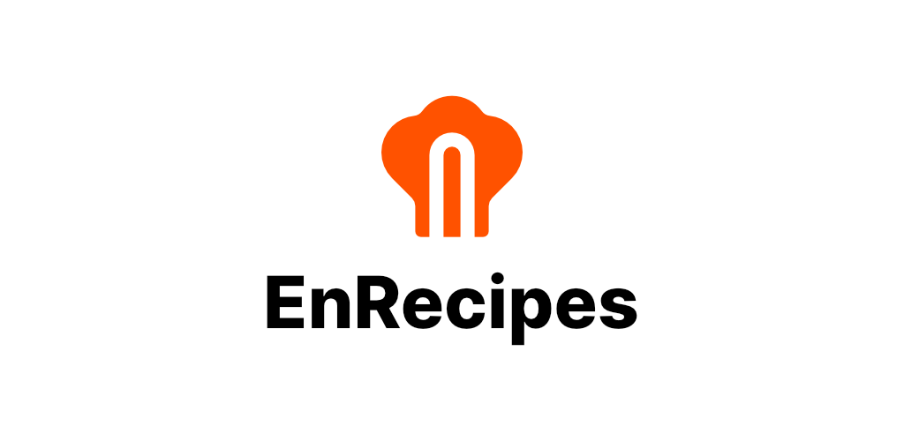
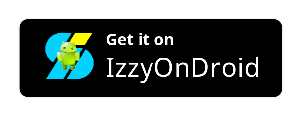
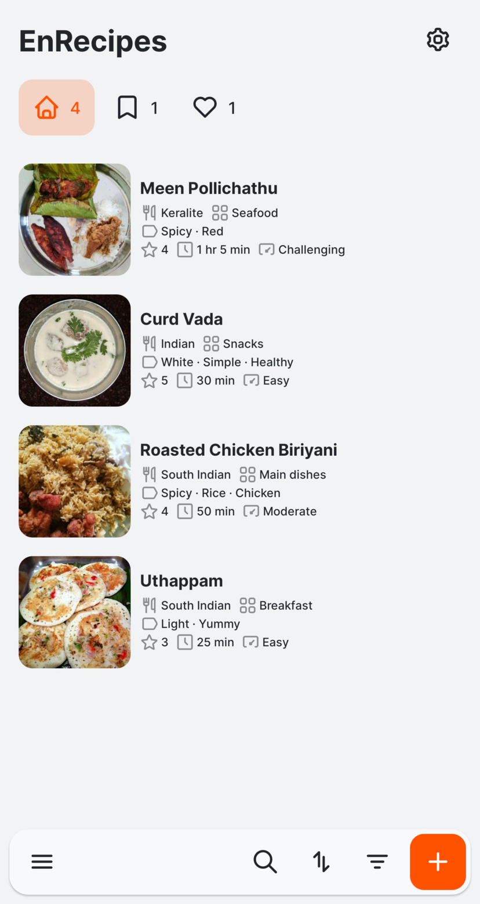
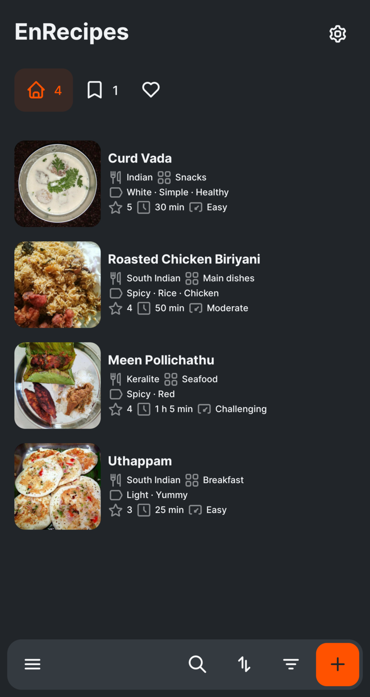
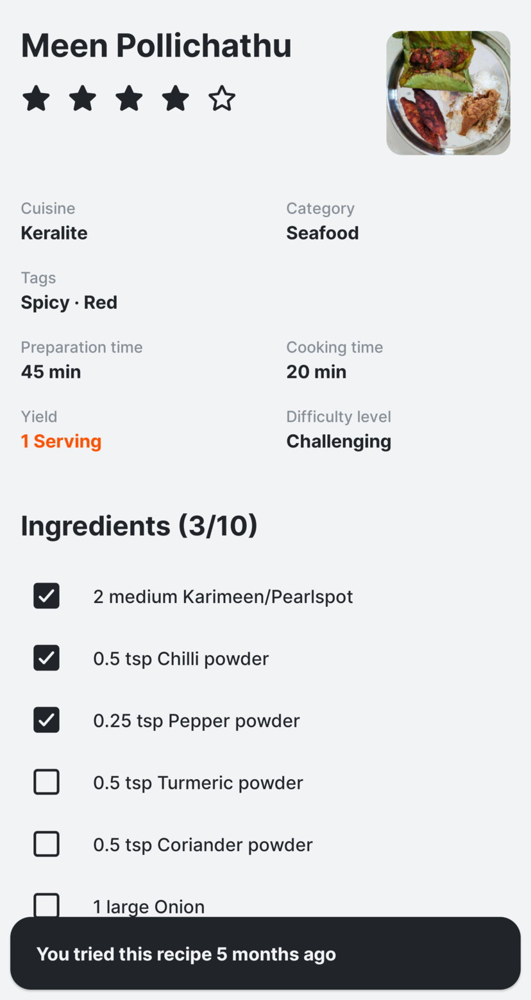
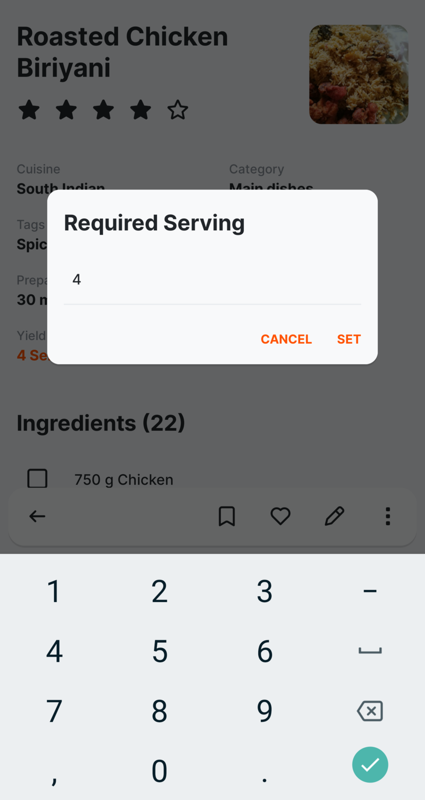
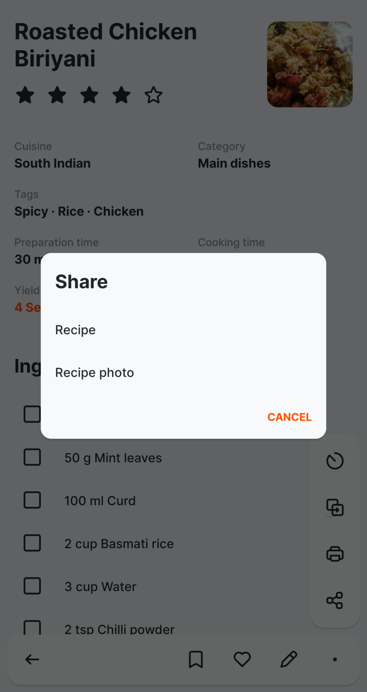
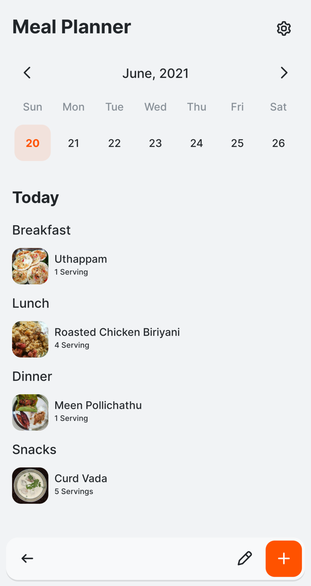
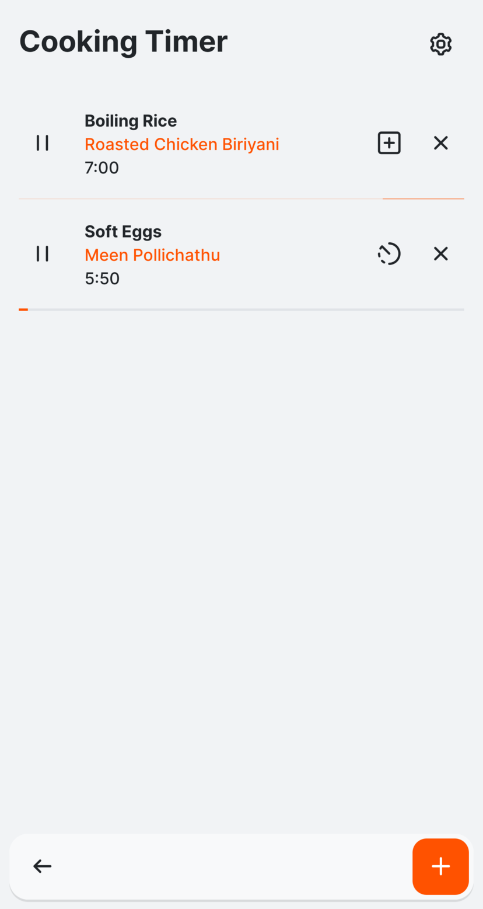
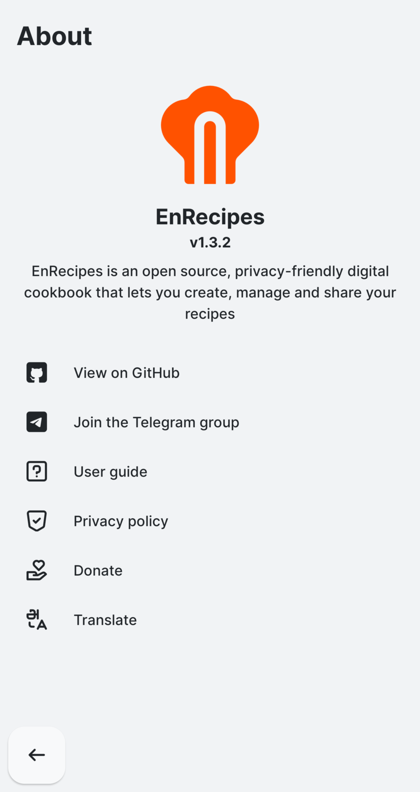

## ⏸️ This project has been PAUSED for an unknown period of time.

#### :warning: IMPORTANT NOTICE for users with EnRecipes v1.3.2 or before:

To continue receiving updates, please update your EnRecipes to the latest version.

There are some significant changes in this version. So, in order to continue, you must do the following:

1. Export a full backup.
2. Uninstall EnRecipes.
3. Install this version and Import your data.

<h1 align="center">A Simple, Offline Recipe Manager</h1>

EnRecipes is an open source, privacy-friendly digital cookbook that lets you create, manage and share your recipes.

  

 You can also get the <a href="https://github.com/vishnuraghavb/EnRecipes/releases/latest">latest release on GitHub</a>

<h2 align="center">Enjoying EnRecipes?</h2>

Please consider making a small donation to help fund the project. Developing an application, especially one that is open source and completely free, takes a lot of time and effort.
 
 

<h3 align="center">Important Links</h3>

<a href="https://github.com/vishnuraghavb/EnRecipes/wiki/User-Guide">User Guide</a> · <a href="https://github.com/vishnuraghavb/EnRecipes/blob/main/PRIVACY.md">Privacy Policy</a> · <a href="https://github.com/vishnuraghavb/EnRecipes/blob/main/CONTRIBUTING.md">Contribution Guide</a> · <a href="https://github.com/vishnuraghavb/EnRecipes/projects/1">Roadmap</a> · <a href="https://t.me/enrecipes/">Telegram Group</a> · <a href="https://enrecipes.vercel.app/">Website</a>

## Features

- Create recipes quickly
- Add photo, combinations and notes to your recipes
- Organise your recipes by cuisine, category and tags
- Add recipes to your Try Later list and mark them as favourites
- Quickly search for recipes by title or ingredient
- Scale your recipe ingredients to serve more or less people
- Get notified of the last time you tried a recipe
- Share your recipe to anyone by any means as a nicely formatted message. You can share the recipe photo too.
- Shake your device to view a random recipe
- Create meal plans
- Set cooking timers
- You can Import or Export your data
- Light, Dark and Black themes

## Highlights

- 100% free and open-source
- Private by Design
- No special permissions required
- No annoying ads or pop-ups

Check the [Roadmap](https://github.com/vishnuraghavb/EnRecipes/projects/1) for upcoming features.

Please read the [User Guide](https://github.com/vishnuraghavb/EnRecipes/wiki/User-Guide) to get the most out of EnRecipes.

## Screenshots

|  |  |
| :---------------------------------------------------------------------------------: | :---------------------------------------------------------------------------------: |
|                               **Home - Light theme**                                |                                **Home - Dark theme**                                |
|  |  |
|                                   **Recipe view**                                   |                                **Scale ingredients**                                |
|  |  |
|                                   **Share menu**                                    |                                  **Meal Planner**                                   |
|  |  |
|                                  **Cooking Timer**                                  |                                      **About**                                      |

## Contribution

Check out the [Roadmap](https://github.com/vishnuraghavb/EnRecipes/projects/1) and [Issues](https://github.com/vishnuraghavb/EnRecipes/issues) before proceeding.

Your feedback and suggestions are very important to make EnRecipes the best. If you have an idea to improve EnRecipes, [join the Telegram group](#having-issues-suggestions-and-feedback) to start discussing. I'm always open to ideas ;)

### Having issues, suggestions and feedback?

You can,

- [Create an issue here](https://github.com/vishnuraghavb/EnRecipes/issues)
- [Join the Telegram group](http://t.me/enrecipes) (quicker replies)
- Contact me at apps@vishnuraghav.com

### Looking to translate EnRecipes?

EnRecipes is being translated using [Weblate](https://hosted.weblate.org/engage/enrecipes/). See [translation instructions](https://github.com/vishnuraghavb/EnRecipes/wiki/Translation-Instructions) in the wiki for more information.

<!--  -->

## Credits

This app was written in my free time using NativeScript-Vue. I would like to thank all those people who helped me understand the concepts during the process and my special thanks to the NativeScript team and the community. I also would like to thank the members of the [EnRecipes Telegram group](https://t.me/enrecipes) for contributing their ideas for this project.

### Translation credits

| Language                 | Translator(s)                                                                                                                                                                                                  |
| ------------------------ | -------------------------------------------------------------------------------------------------------------------------------------------------------------------------------------------------------------- |
| Arabic                   | [phwright](https://hosted.weblate.org/user/phwright/)                                                                                                                                                          |
| Catalan                  | J. Lavoie                                                                                                                                                                                                      |
| Danish                   | [mondstern](https://hosted.weblate.org/user/mondstern/), Henrik Dankvardt, J. Lavoie, Allan Nordhøy, Jonas Hansen                                                                                              |
| Dutch                    | Heimen Stoffels                                                                                                                                                                                                |
| English (India)          | Vishnu Raghav B                                                                                                                                                                                                |
| English (United Kingdom) | Vishnu Raghav B                                                                                                                                                                                                |
| English (United States)  | Vishnu Raghav B                                                                                                                                                                                                |
| Finnish                  | J. Lavoie                                                                                                                                                                                                      |
| French                   | J. Lavoie, Swann Fournial, fabeuss, [mondstern](https://hosted.weblate.org/user/mondstern/)                                                                                                                    |
| French (Canada)          | Swann Fournial, J. Lavoie                                                                                                                                                                                      |
| French (Switzerland)     | Swann Fournial, J. Lavoie                                                                                                                                                                                      |
| French (Belgium)         | Swann Fournial, J. Lavoie                                                                                                                                                                                      |
| German                   | J. Lavoie, nautilusx, Swann Fournial                                                                                                                                                                           |
| Hindi                    | Vishnu Raghav B, V                                                                                                                                                                                             |
| Indonesian               | Reza Almanda, [mondstern](https://hosted.weblate.org/user/mondstern/)                                                                                                                                          |
| Italian                  | J. Lavoie, [mondstern](https://hosted.weblate.org/user/mondstern/), Andrea Ghensi                                                                                                                              |
| Japanese                 | Y. Sakamoto, K. Herbert                                                                                                                                                                                        |
| Malayalam                | Vishnu Raghav B                                                                                                                                                                                                |
| Norwegian Bokmål         | Allan Nordhøy, [mondstern](https://hosted.weblate.org/user/mondstern/), Lars A Reinton                                                                                                                         |
| Portuguese               | Sérgio Morais, [mondstern](https://hosted.weblate.org/user/mondstern/), J. Lavoie                                                                                                                              |
| Portuguese (Brazil)      | [mondstern](https://hosted.weblate.org/user/mondstern/), Sérgio Morais, Wesley, Ricardo Zamarrenho Carvalho Correa, J. Lavoie, Nínive de Jesus Celestino, emmanuel einstein campos vasconcelos, Fabio Oliveira |
| Russian                  | dm9pZCAq, [mondstern](https://hosted.weblate.org/user/mondstern/), Leca                                                                                                                                        |
| Spanish                  | taraletti, J. Lavoie, Sansom, [mondstern](https://hosted.weblate.org/user/mondstern/), Diego                                                                                                                   |
| Spanish (Argentina)      | another-sapiens                                                                                                                                                                                                |
| Tamil                    | Vishnu Raghav B                                                                                                                                                                                                |

### Screenshot recipe credits

- **Meen Pollichathu** by [Bency Veronica](https://www.instagram.com/bencys_lil_kitchen)
- **Curd Vada** by P. Shanmugalakshmi
- **Roasted Chicken Biriyani** by [Ranga](https://www.youtube.com/channel/UC6ONI92scjwMmk3IITKIx-g)

### Assets

- Icon font and Logo by [Vishnu Raghav](https://www.vishnuraghav.com/)

## License

    EnRecipes - A Simple, Offline Recipe Manager
    Copyright (C) 2020  Vishnu Raghav B

    This program is free software: you can redistribute it and/or modify
    it under the terms of the GNU General Public License as published by
    the Free Software Foundation, either version 3 of the License, or
    (at your option) any later version.

    This program is distributed in the hope that it will be useful,
    but WITHOUT ANY WARRANTY; without even the implied warranty of
    MERCHANTABILITY or FITNESS FOR A PARTICULAR PURPOSE.  See the
    GNU General Public License for more details.

    You should have received a copy of the GNU General Public License
    along with this program.  If not, see <https://www.gnu.org/licenses/>.
